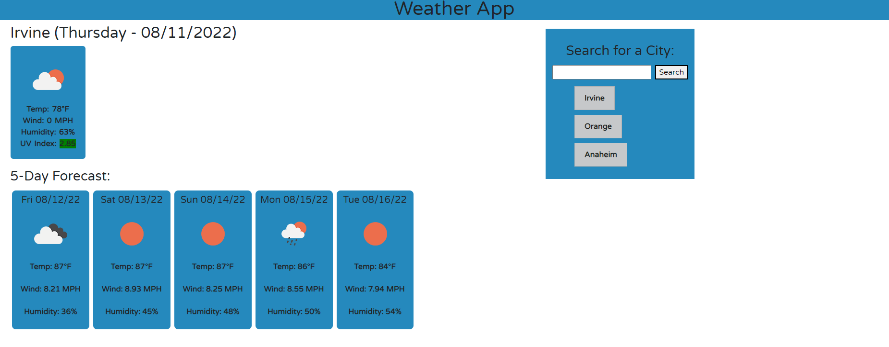

# Weather Dashboard

## NOTE: please use your own API key and create a config.js file. (Refer to sampleconfig.js for how to set up the API Key)

In this application, you will find a simple weather app. The user can search for a city and the current weather coditions plus a 5-day weather forecast is shown.
Additionally, the searched city will be added to a search history and the user can search for another city. From the search history, the user can click any city and the weather report will be retrieved.

If the user navigates away from the site and then returns, the search history for that user is still saved and displayed. The user can there either search for a new city or retrieve any of the searched cities from the history.

In the weather report, the user can view the current weather conditions and UV-index is highlighted based on the severity of its value. Also an icon is shown to represent the weather conditions.

----
## [Link to Depolyed Application](https://momaki9.github.io/Weather_Dashboard/)

----
----
## [Link to Code on GitHub](https://github.com/momaki9/Weather_Dashboard)
----
----
## 
----
----